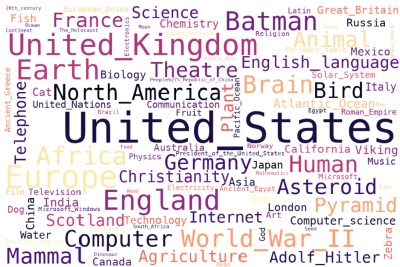
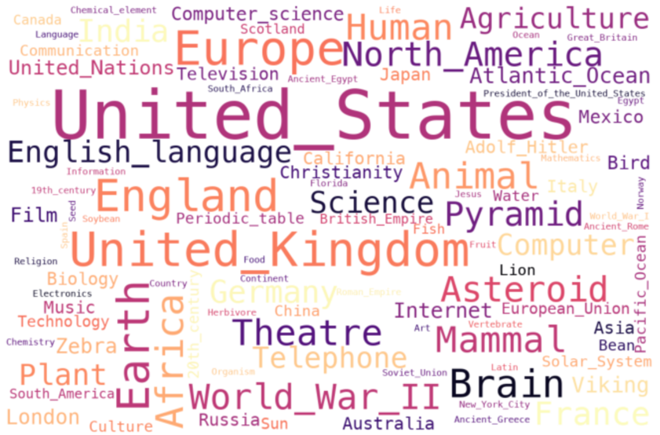

# ada-2022-project-surviving4ada
Team member: Zhan Li, Yuheng Lu, Xiyun Fu, Yichen Liu
### Abstract
Wikispeedia is a dataset that collected human navigation paths on Wikipedia in terms of games, which implies all the connection between articles is created from human intuition. As wikispeedia dataset can be considered as a language “map”, including tons of criss-cross article navigation paths, we try to find out 100 of the most popular words that were identified as linguistic 'transport hubs', based on their click-through and reach rates. After clustering, they are compared with other datasets (e.g. media corpus, national economic power, technological development index) to find out whether these 'transport hubs' are equally influential in the real world, and whether their impact changes with time.

In addition, we are also curious about the semantic distance between articles. Is the length of the path between two words representative of the semantic distance between the two articles? We compared the path lengths with the results of using vector embeddings.

### Research questions
1. By counting the number of times a word appears in paths during one whole year, which are the top 100 articles？
2. Are the words most popular in wikispeedia also most ‘powerful’ in other datasets? We selected two datasets, xx and xx, for an initial comparison.
3. If the answer of question 2 is yes, are their changing trends in different years matching too?
4. Whether the semantic distance defined based on path length shows consistency with the similarity analysis based on the vector embeddings？

### Addition dataset
1. **News Category Dataset** from kaggle.
   The format of the data can be found in the News_Category_Dataset_v3.json file. We scrap only the attributes "headline", "date" for the investigation of each ‘Transport Hub’ ‘s popularity in the media.
2. **GDP** from World Bank website
    The csv file GDP_world_bank contains every country's GDP from 1960-2022. We will use the ‘Country” and “2011”,”2012”,”2013” column.

### Methods
#### **Initial data processing**
- Drop the rows which have null elements in column 'hashedIpAddress'
- Only data from 2011-2014 are retained to align the unfinished dataset with the finished dataset in the time feature
- Split the strings in the column 'path' and transform them into lists
- Considering the excessive difference in volume between the 2014 data and the 2011-2013 data, we will not consider the 2014 data for the time being

#### **Find the highest frequent articles**
Identify the 100 most frequently occurring words in the paths each year, and use WordCloud plot to show how often each article is passed over relatively.
##### **Visualisation**
- 
- 
- 

#### **Determining category granularity**
We wanted to rank the frequency of occurrence of articles in the same category and then compare the degree of overlap with the corresponding words in the additional dataset. Considering that the classification needs to be easy to understand and that each category should contain a sufficient number of articles, we chose the penultimate level category of the articles as the unique category.

### **Proposed timeline and individual Milestones**

